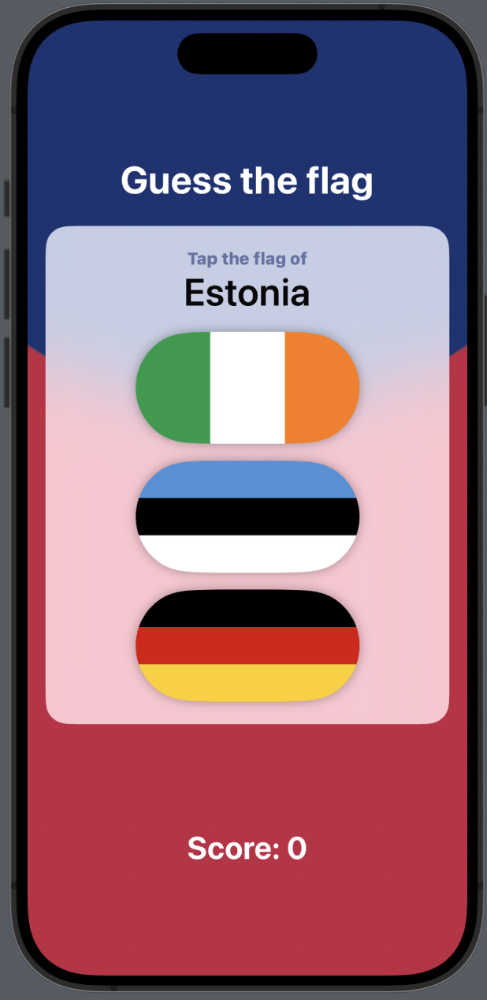
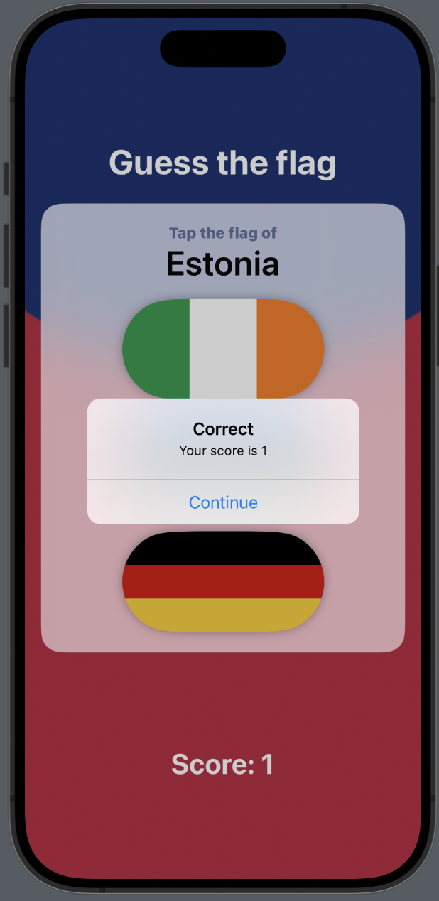
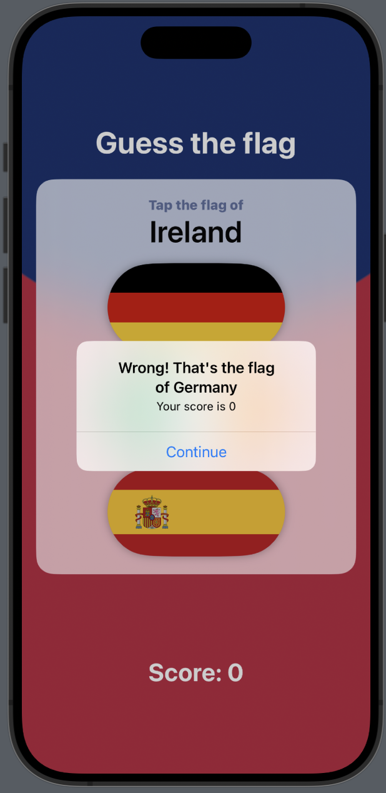
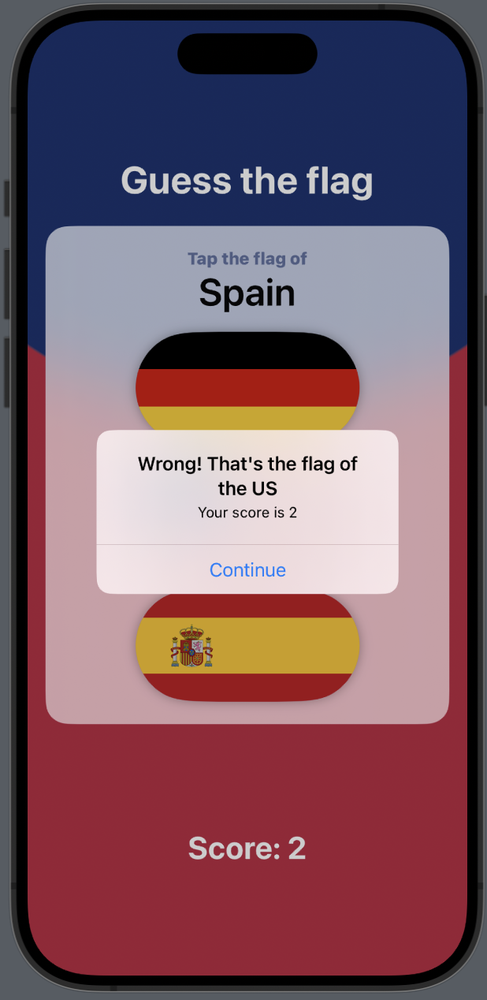

<h1 align="center"># Guess The Flag

## Overview

Guess The Flag is a SwiftUI-based iOS app developed as part of the HackingWithSwift project by Paul Hudson. The app challenges users to identify the correct country flag out of a set of three options. The game is designed to test and enhance users' knowledge of various country flags in an interactive and engaging way.

## Features

- Shuffled set of flags for each game session.
- Real-time scoring system to track user performance.
- Informative feedback for correct and incorrect answers.
- Game over screen displaying the final score.
- Ability to start a new game and reset the score.

## Screenshots
<p align="center" style="display:flex; justify-content: space-between;">




</p>

## Getting Started

To run the Guess The Flag app on your local machine, follow these steps:

1. Clone the repository to your local machine:

   ```bash
   git clone https://github.com/charlella/Guess-the-flag.git
